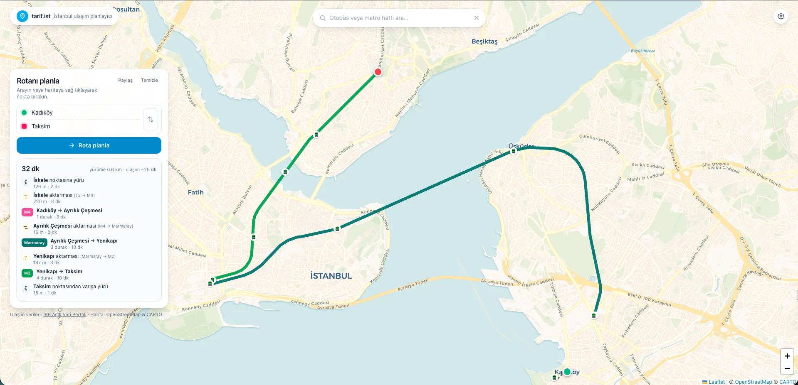
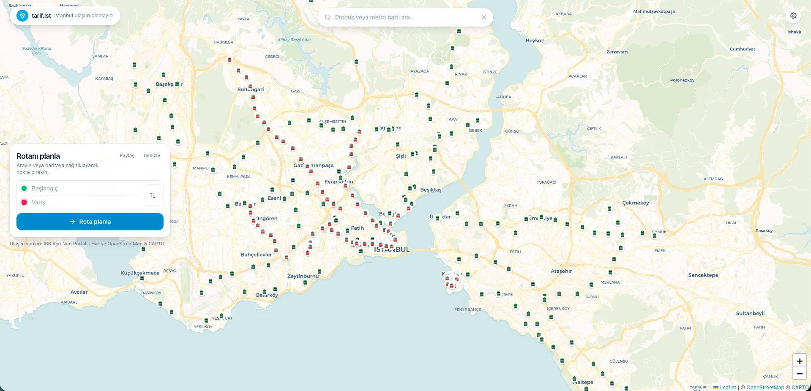
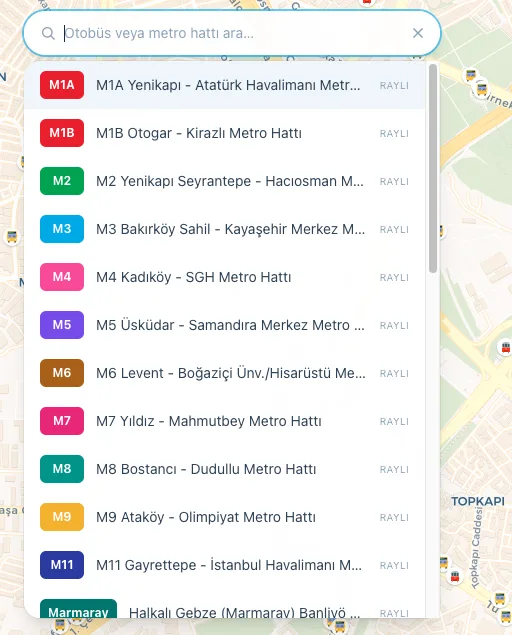
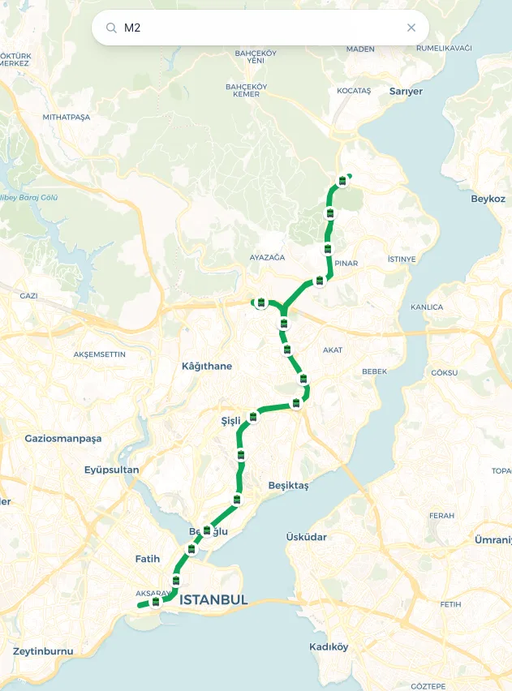

# tarif.ist

Open-source transit directions for Istanbul. Plan a route across rail, metro,
Marmaray, funicular, and IETT bus on one map — with walking legs routed on
real footpaths, live service disruptions overlaid on affected lines, and
shareable read-only links for any planned trip.

🌐 **Live:** [tarif.ist](https://tarif.ist)

> "Tarif" is Turkish for *directions*. The `.ist` is Istanbul.



## Features

- **Multimodal routing** — rail, metro, Marmaray, funicular, tram, and IETT
  buses, with transfers between modes.
- **Real walking legs** — first/last-mile and transfers are routed on the
  OSM foot network (OSRM), not straight lines.
- **Live disruptions** — Metro İstanbul service alerts overlaid on affected
  segments.
- **Smart search** — Photon (primary) with Nominatim fallback handles partial
  input, typos, and Turkish diacritics.
- **Shareable routes** — every itinerary encodes into a single URL; the
  recipient sees the same route verbatim, no re-planning.
- **Bilingual** — Turkish (default) and English.
- **Light & dark themes** — follows system preference, user-overridable.

## Screenshots

| Map overview | Line search |
| --- | --- |
|  |  |

| Line selected (M2) |
| --- |
|  |

## Stack

- **TypeScript** + **Vite** + **Tailwind CSS v4**
- **Leaflet** for the map
- **CARTO** Voyager / Dark basemap tiles
- **OpenStreetMap** data (geocoding via Photon + Nominatim, walking via OSRM)
- **İBB Açık Veri Portalı** for GTFS, rail, and bus data
- **Metro İstanbul API** for live service disruptions

No backend — everything runs in the browser. The transit graph is built
client-side at boot from static JSON shipped from `public/data/`.

## Local development

```sh
git clone https://github.com/berkaycubuk/tarif.ist.git
cd tarif.ist
npm install
npm run dev
```

The first `npm run dev` (or `npm run build`) automatically syncs the
underlying transit data from public sources via the `predev` / `prebuild`
hooks.

To refresh data manually:

```sh
npm run sync:data    # rail/metro lines, stations
npm run sync:gtfs    # GTFS feeds
npm run sync:bus     # IETT bus routes & stops
```

### Build

```sh
npm run build        # type-check + production bundle into dist/
npm run preview      # serve the production build locally
```

## Project layout

```
src/
  main.ts              # bootstrap
  map.ts               # Leaflet map + theming
  transit.ts           # rail line/station layers
  bus.ts               # IETT bus routes & stops
  graph.ts             # transit graph builder
  router.ts            # multimodal Dijkstra
  route-render.ts      # draws the planned route on the map
  walk-routing.ts      # OSRM foot-routing client
  geocode.ts           # Photon + Nominatim
  autocomplete.ts      # search-as-you-type
  plan-panel.ts        # editable route panel
  route-viewer.ts      # read-only shared-route panel
  route-share.ts       # URL encoding/decoding
  disruptions.ts       # live alert overlay
  ...
public/data/           # synced transit data (regenerated, gitignored)
scripts/               # data-sync scripts
```

## Contributing

Issues and pull requests welcome. For larger changes, please open an issue
first to discuss the approach.

## Data sources & attribution

- **Map tiles:** © [CARTO](https://carto.com/attributions),
  © [OpenStreetMap contributors](https://www.openstreetmap.org/copyright)
- **Transit data:** [İBB Açık Veri Portalı](https://data.ibb.gov.tr) (IETT,
  Metro İstanbul)
- **Geocoding:** [Photon](https://photon.komoot.io) by Komoot,
  [Nominatim](https://nominatim.openstreetmap.org)
- **Foot routing:** [OSRM](https://routing.openstreetmap.de) public instance

This project follows the usage policies of every upstream service it talks
to (debounced requests, client-side caching, bounded query volume).

## License

[MIT](LICENSE) © Berkay Çubuk
