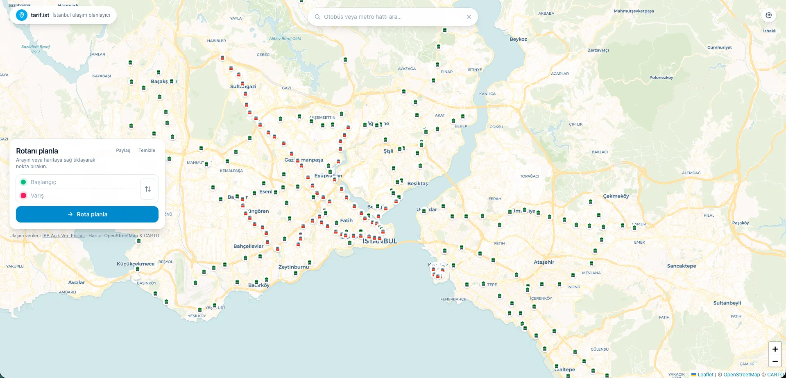
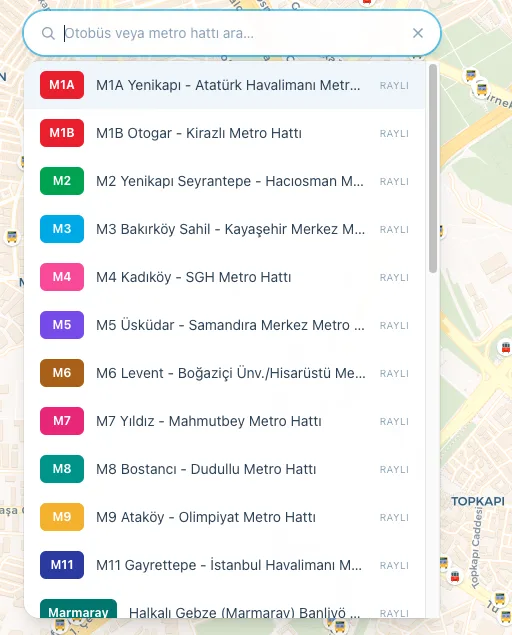
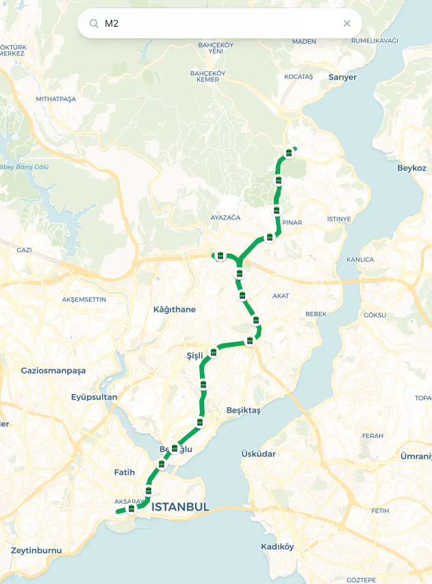

# tarif.ist

Open-source live transit map for Istanbul. See every metro, Marmaray, tram,
and funicular line on one map with live train positions and live service
disruptions overlaid on affected segments. Route planning isn't here yet —
this is a live data viewer first.

🌐 **Live:** [tarif.ist](https://tarif.ist)

> "Tarif" is Turkish for *directions*. The `.ist` is Istanbul.

## Features

- **Full rail network** — every metro, Marmaray, tram, and funicular line
  and station on a single map.
- **Live train positions** — current train locations on the selected line,
  polled from the livepos backend.
- **Live disruptions** — Metro İstanbul service alerts overlaid on affected
  segments.
- **Smart line search** — find any line by code or name, in Turkish or
  English.
- **Bilingual** — Turkish (default) and English.
- **Light & dark themes** — follows system preference, user-overridable.

## Screenshots

| Map overview | Line search |
| --- | --- |
|  |  |

| Line selected (M2) |
| --- |
|  |

## Stack

- **TypeScript** + **Vite** + **Tailwind CSS v4**
- **Leaflet** for the map
- **CARTO** Voyager / Dark basemap tiles
- **OpenStreetMap** data (geocoding via Photon + Nominatim, walking via OSRM)
- **İBB Açık Veri Portalı** for GTFS, rail, and bus data
- **Metro İstanbul API** for live service disruptions

No backend — everything runs in the browser. The transit graph is built
client-side at boot from static JSON shipped from `public/data/`.

## Local development

```sh
git clone https://github.com/berkaycubuk/tarif.ist.git
cd tarif.ist
npm install
npm run dev
```

The first `npm run dev` (or `npm run build`) automatically syncs the
underlying transit data from public sources via the `predev` / `prebuild`
hooks.

To refresh data manually:

```sh
npm run sync:data    # rail/metro lines, stations
npm run sync:gtfs    # GTFS feeds
npm run sync:bus     # IETT bus routes & stops
```

### Build

```sh
npm run build        # type-check + production bundle into dist/
npm run preview      # serve the production build locally
```

## Project layout

```
src/
  main.ts              # bootstrap
  map.ts               # Leaflet map + theming
  transit.ts           # rail line/station layers
  bus.ts               # IETT bus routes & stops
  graph.ts             # transit graph builder
  router.ts            # multimodal Dijkstra
  route-render.ts      # draws the planned route on the map
  walk-routing.ts      # OSRM foot-routing client
  geocode.ts           # Photon + Nominatim
  autocomplete.ts      # search-as-you-type
  plan-panel.ts        # editable route panel
  route-viewer.ts      # read-only shared-route panel
  route-share.ts       # URL encoding/decoding
  disruptions.ts       # live alert overlay
  ...
public/data/           # synced transit data (regenerated, gitignored)
scripts/               # data-sync scripts
```

## Contributing

Issues and pull requests welcome. For larger changes, please open an issue
first to discuss the approach.

## Data sources & attribution

- **Map tiles:** © [CARTO](https://carto.com/attributions),
  © [OpenStreetMap contributors](https://www.openstreetmap.org/copyright)
- **Transit data:** [İBB Açık Veri Portalı](https://data.ibb.gov.tr) (IETT,
  Metro İstanbul)
- **Geocoding:** [Photon](https://photon.komoot.io) by Komoot,
  [Nominatim](https://nominatim.openstreetmap.org)
- **Foot routing:** [OSRM](https://routing.openstreetmap.de) public instance

This project follows the usage policies of every upstream service it talks
to (debounced requests, client-side caching, bounded query volume).

## License

[MIT](LICENSE) © Berkay Çubuk
